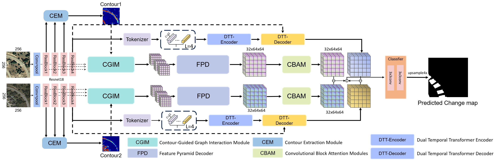
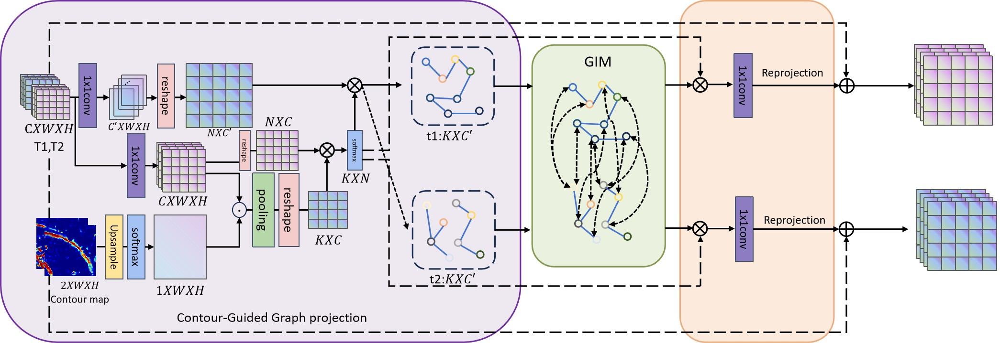

# A Dual Temporal Transformer Network With Multi-scale Contour Guided Graph Interaction For Change Detection

Here, we provide the pytorch implementation of the paper: A Dual Temporal Transformer Network With Multi-scale Contour Guided Graph Interaction For Change Detection

For more ore information, please see our published paper at 
## Overall Architecture



## Contour-Guided Graph Interaction Module



## Requirements

```
albumentations==1.3.1
numpy==1.21.5
opencv_python==4.8.1.78
opencv_python_headless==4.8.0.76
Pillow==9.1.0
scikit_learn==1.0.2
torch==1.7.1+cu110
torchvision>=0.8.2+cu110
wandb==0.15.8
```

## 1. Installation

Clone this repo:

```shell
git clone https://github.com/WesternTrail/DTT_CGINet.git
cd DTT_CGINet
```

## 2. Download the Datasets
We provide processed data sets and divided the train/val/test. All data sets are divided into 256 x 256 patches according to the method mentioned in the paper.

- LEVIR-CD256: [baidu drive, code: r2ex](https://pan.baidu.com/s/1stWO18_PALcWpORrF2DB6Q?pwd=r2ex)
 
- BCDD256: [baidu drive, code: bo65](https://pan.baidu.com/s/1ATaLEoUZp0m2B0c9yCpFdw?pwd=bo65)

- CDD: [baidu drive, code: w2wf](https://pan.baidu.com/s/1nlDUY0yqLPF4fvwngzCeCA?pwd=w2wf)

### Directory Structure
 
File Structure is as follows:

```
./
├─data
└─DTT_CGINet

data:
├─BCDD256
│  ├─test
│  │  ├─A
│  │  ├─B
│  │  └─label
│  ├─train
│  │  ├─A
│  │  ├─B
│  │  └─label
│  └─val
│      ├─A
│      ├─B
│      └─label
├─LEVIR-CD
└─CDD
```
## 3. Download the models (loading models):
- [models](https://pan.baidu.com/s/1N-TBdlq1tsMCBGkd8ImewA?pwd=c3tp) code: c3tp

and put them into checkpoints directory.


## 4. Train

* The training process uses **wandb** to record logs, so you may need to set a proxy for the cmd command line before training.
Please modify the following shell command appropriately:
	```shell
	set http_proxy=http://127.0.0.1:7890 
	set https_proxy=http://127.0.0.1:7890
	```
 
- After the proxy is set up, Then start training by: 
	```shell
	python train.py --data_path ${train_data_path} --val_path ${val_data_path} --lr ${lr} --batch_size ${-batch_size} 
	```

## 5. test
- We evaluate the test set to obtain **precision**, **recall** and **F1**. When testing, please ensure that the mean and std of the corresponding data set are used during training. 
We use [calc_dataset_mean_std.py](calc_dataset_mean_std.py) to calculate the mean of the training set. and std. Start testing by:
	```shell
	python test.py --ckpt_url ${model_path} --data_path ${test_data_path}
	```

## 6. predict
- We use this command to generate a change map. Similar to test, [predict.py](predict.pyL58) also needs to modify the mean and std corresponding to the data set. 
Start predicting by:
	```shell
	python predict.py --ckpt_url ${model_path} --data_path ${test_data_path}
	```

## 7. Citation
If our repo is useful to you, please cite our published paper as follow:


